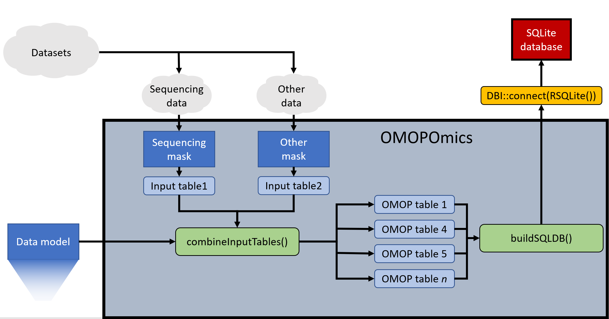
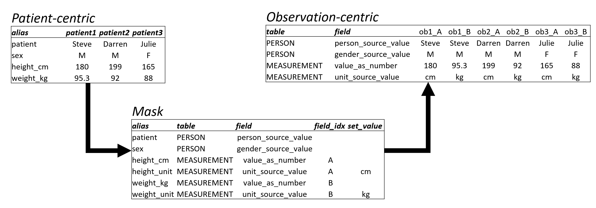

```{r setup, include=FALSE}
library(tidyverse)
library(dbplyr)
library(data.table)
library(rmarkdown)
library(knitr)
library(kableExtra)
library(rprojroot)
library(RSQLite)
library(ROMOPOmics)
knitr::opts_chunk$set(echo = TRUE)

dirs          <- list()
dirs$base     <- file.path(find_root(criterion = criteria$is_r_package))
dirs$figs     <- file.path(dirs$base,"man/figures")
dirs$demo     <- file.path(dirs$base,"demo")
dirs$data     <- file.path(dirs$demo,"data")
dirs$masks    <- file.path(dirs$demo,"masks")

#Files.
dm_file     <- system.file("extdata","OMOP_CDM_v6_0_custom.csv",package="ROMOPOmics",mustWork = TRUE)
tcga_files  <- dir(dirs$data,full.names = TRUE)
names(tcga_files) <- gsub(".csv","",basename(tcga_files))

select <- dplyr::select

dm <- loadDataModel(as_table_list = FALSE)

```

# ROMOPOmics

The purpose of ROMOPOmics is to facilitate integration of patient-level clinical data with sample-level 'omics data. Biomedical research datasets such as RNA-Seq experiments or other next generation sequencing datasets contain a mixture of clinical traits of the studied patients including data derived from samples perturbed by different assays, at different timepoints,with varying protocols, and more. Additionally, next generation sequencing datasets include metadata on pipeline byproducts (alignment files, raw reads, readmes, etc.) and analysis results of any type (gene counts, differential expression data, quality control analyses, etc.). Our package ROMOPOmics provides a framework to standardize these datasets and a pipeline to convert this information into a SQL-friendly database that is easily accessed by users. After installation from our github repository, users specify a data directory and a mask file describing how to map their data's fields into a common data model. The resulting standardized data tables are then formatted into a SQLite database for easily interoperating and sharing the dataset.



## Customizing [OMOP 6.0](https://github.com/OHDSI/CommonDataModel/blob/master/OMOP_CDM_v6_0.csv) data model.

The foundation of this package is the [OMOP 6.0](https://github.com/OHDSI/CommonDataModel/blob/master/OMOP_CDM_v6_0.csv) common data model (though it should be compatible with custom models as well). Unless a custom data model is provided, the package defaults to using a custom version of the OMOP 6.0 data model which is packaged within `extdata`. This version of the OMOP data model includes `r nrow(dm)` fields distributed among `r length(unique(dm$table))` tables. Unique to this version is the inclusion of an `hla_source_value` field in the `PERSON` table meant to incorporate [histocompatibility complex types](https://www.merckmanuals.com/professional/immunology-allergic-disorders/biology-of-the-immune-system/human-leukocyte-antigen-hla-system) as a key individual characteristic rather than as a separate observation. Second, our customized version includes a `SEQUENCING` table: 

```{r previewCustomOMOP,echo=FALSE}
dm %>% 
  filter(table=="sequencing") %>%
  mutate(description = gsub(" CUSTOM$","",description)) %>%
  select(-table_index) %>%
  mutate_all(function(x) gsub("_"," ",x)) %>%
  kable(escape = TRUE) %>%
  kable_styling(full_width=FALSE,latex_options = "striped")
```

There are two main reasons for including this 'mask' table. 

1) Sequencing data is becoming ubiqutious in contemporary research, and is an increasingly common component of personalized medicine treatment regimens. 

2) Unlocking the full information within next generation experiments behooves these "Sequencing" datasets to include the spectrum of products generated along any testing pipeline, from library preparation to sequencing to data analysis. This allows for intermediate steps and files to be used (getting and using raw files rather than processed and normalized gene counts, for example), but crucially it facilitates comparisons between different studies and treatments by allowing comparisons of library preparation, quality control, alignment methods, reference data, etc.  Including this data is crucial, but incorporating this variety of variables is not intuitive in the existing OMOP model.

# Package algorithm

## Step 1: Load the data model.

Loads the master common data model file from *extdata* and return the table's information as a data dictionary to be referenced later to standardize the mask data.

```{r loadDataModel,echo=TRUE}

dm <- loadDataModel(as_table_list = FALSE)

```


## Step 2: Design and load input masks.

```{r loadMasks,echo=TRUE}

msks    <- loadModelMasks(mask_file_directory = dirs$masks)

```


"Masks" streamline the mapping of values from existing data sets to OMOP format, or at least to how the database's *admin* thinks these data sets should be mapped. See the files in `r dirs$masks` for examples of masks files used here. 

Mask files are tables which provide `alias`, `table`, and `field` columns that describe each term's name in the input dataset, its destination OMOP table, and name within that table, respectively. For instance, `patient_name` in the user's database will likely map to `person_source_value` in current OMOP parlance. Using multiple masks should streamline the use of multiple analysis types as well: the database administrators can develop and implement masks and users won't need to know that `patient_name` and `cell_line_name` are both synonymous with `person_source_value` in the OMOP framework, for instance. Next generation sequencing data can be added using the `sequencing` mask, while "HLA"" data can be incorporated using an `hla` mask. 

Here's an example of a mask formatted [TCGA](https://www.cancer.gov/about-nci/organization/ccg/research/structural-genomics/tcga) clinical data, provided to the `loadModelMasks()` function as a CSV:

```{r previewClinicalMask,echo=FALSE,eval=TRUE}
msks$brca_clinical %>%
  select(alias,table,field,field_idx,set_value,example1) %>%
  mutate_all(function(x) ifelse(is.na(x),"",x)) %>%
  rename(example=example1) %>%
  mutate_all(function(x) gsub("_"," ",x)) %>%
  kable() %>%
  kable_styling(full_width = FALSE) %>%
  row_spec(0,font_size = 20,italic=TRUE,hline_after = TRUE) %>%
  column_spec(c(1:3),color="black") %>%
  column_spec(c(1),background = "lightgray",border_right = TRUE,border_left = TRUE) %>%
  column_spec(c(2),bold=TRUE) %>%
  column_spec(c(4,5),color = "gray")
```


**Column names:**

1. **alias**: Field name for a value according to the input dataset.
2. **field**: Field name for a value according to the selected data model.
3. **table**: Table name for a value according to the selected data model.
4. **field_idx**: Used to differentiate between observations (see below).
5. **set_value**: Default value that is added to the given table and field regardless of input. Useful for specifying units, descriptions, etc. when facilitating the multiple-column transition.

### Patient vs. observation-centric datasets

The OMOP format anticipates data tables with one column per treatment/observation/measurement, while many datasets are formatted with one  treatment/observation/measurement column per patient. As an example, consider this translation of a simple input dataset with two descriptors and two observations:



ROMOPOmics converts this wide, unstandardized data formatby using a `field_idx` variable. Appending a `field_idx` value allows for observations to be "grouped" into an observation complete with their units, descriptions, etc.


## Step 3: Translate input datasets into data model format.

Using the `readInputFiles()` function, data table inputs are translated into the destination format according to the provided `mask` (in this case `brca_clinical` and `brca_mutation`). Tables in this format are "exhaustive" in that they include all possible fields and tables in the data model, including unused ones. It is not required that every variable in the input tables are present in the mask tables. Only variables in the input tables that are mapped to the common data model format in the mask tables. 

```{r saveMasks,echo=TRUE,message=FALSE}
omop_inputs <- lapply(names(tcga_files), function(x) readInputFiles(input_file = tcga_files[[x]],
                                                                    mask_table = msks[[x]],
                                                                    data_model = dm))
```

## Step 4: Combine all input tables into SQL-friendly tables.

Since tables read via `readInputFiles()` include all fields and tables from the data model, these tables can be combined regardless of input type or mask used using `combineInputTables()`. This function combines all data sets from all mask types, and filters out all OMOP tables from the data model that are unused (no entries in any of the associated fields). Tables are not "partially" used; if any field is included from that table, all fields from that table are included. The only exception to this is table indices: if a table inherits an index from an unused table, that index column is dropped.

Once data has been loaded into a single comprehensive table, an index column (`<table_name>_index`) is assigned for each permutation of all data sets included in each used table, and formats the `type` of each column based on the data model's specification (`VARCHAR(50)` is changed to "character", `INTEGER` is changed to "integer", etc.). Finally, this function returns each formatted OMOP table in a named list.

```{r parseToOMOP,echo=TRUE}
db_inputs   <- combineInputTables(input_table_list = omop_inputs)
```

In this example using these masks, the OMOP tables included are `r paste(names(db_inputs)[1:(length(db_inputs)-1)],collapse=", ")`, and `r names(db_inputs)[length(db_inputs)]`.

## Step 5: Add OMOP-formatted tables to a database.

The tables compiled in `db_inputs` are now formatted for creating a SQLite database. `Dplyr` has built-in SQLite functionality, which is wrapped in the function `buildSQLDBR()`. However, building a database using any other package is amenable here.

```{r buildDatabase,echo=TRUE}
omop_db     <- buildSQLDBR(db_inputs,sql_db_file = file.path(dirs$base,"sqlDB.sqlite"))

dbListTables(omop_db)
dbListFields(omop_db,"PERSON")
```

### Raw SQLite query:

```{r demoSQLQuery,echo=TRUE,eval=TRUE}

dbGetQuery(omop_db,
'SELECT person_source_value, person.person_id,file_remote_repo_id,file_remote_repo_value
 FROM person INNER JOIN sequencing 
 WHERE file_remote_repo_id IS NOT NULL and person_source_value is "tcga-3c-aaau" 
 ORDER BY "file_remote_repo_value"') %>%
  mutate_all(function(x) gsub("_"," ",x)) %>%
  kable() %>%
  kable_styling(full_width=FALSE) 

```


### DBplyr query:

```{r demoSQLQueryDBPlyr,echo=TRUE,eval=TRUE}

inner_join(tbl(omop_db,"PERSON"),
           tbl(omop_db,"MEASUREMENT")) %>%
  select(person_source_value,
         birth_datetime,
         death_datetime,
         measurement_source_value,
         value_as_number,
         unit_source_value) %>%
  filter(charindex("lymph",measurement_source_value),
         !is.null(death_datetime)) %>%
  as_tibble() %>%
  mutate_all(function(x) gsub("_"," ",x)) %>%
  kable() %>%
  kable_styling(full_width=FALSE)

```


# TL;DR:


```

library(ROMOPOmics)
dm_file     <- system.file("extdata","OMOP_CDM_v6_0_custom.csv",package="ROMOPOmics",mustWork = TRUE)
dm          <- loadDataModel(master_table_file = dm_file)
tcga_files  <- dir(dirs$data,full.names = TRUE)
names(tcga_files) <- gsub(".csv","",basename(tcga_files))
msks        <- loadModelMasks(mask_file_directory = dirs$masks)
omop_inputs <- lapply(names(tcga_files), function(x) readInputFiles(tcga_files[[x]],data_model=dm,mask_table=msks[[x]]))
db_inputs   <- combineInputTables(input_table_list = omop_inputs)
omop_db     <- buildSQLDBR(db_inputs,sql_db_file = file.path(dirs$base,"sqlDB.sqlite"))

```