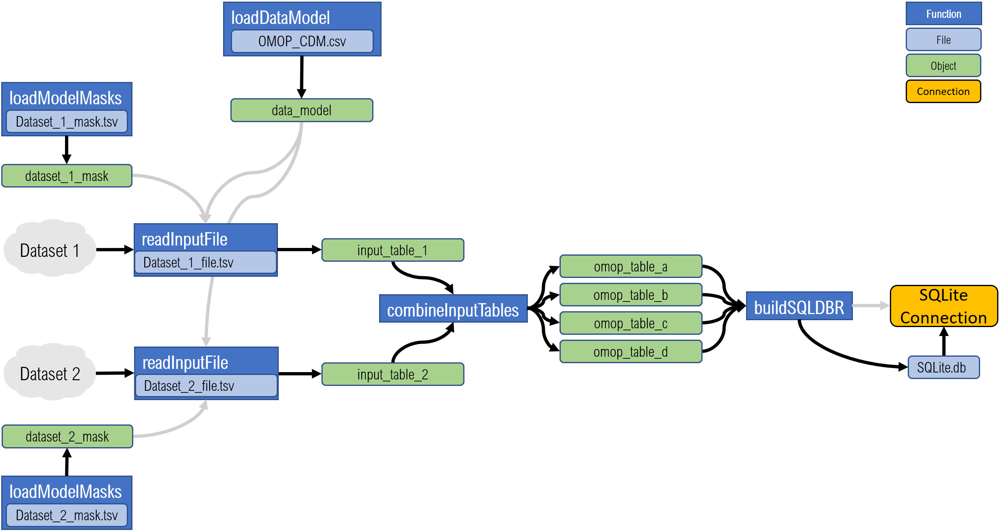
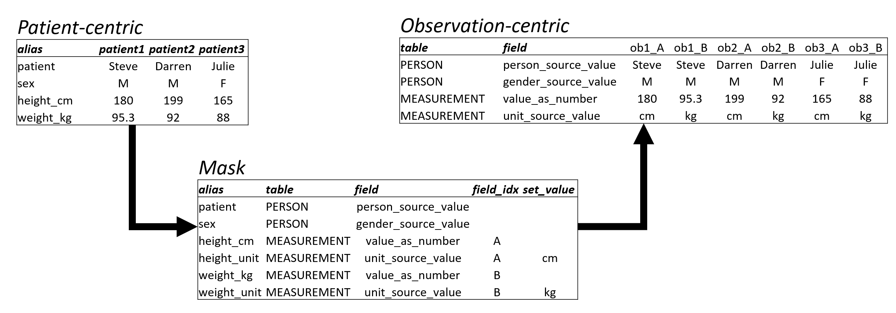

# ROMOPOmics

## Introduction


ROMOPOmics was developed to standardize metadata of high throughput assays with associated patient clinical data. Biomedical research datasets such as RNA-Seq experiments or other next generation sequencing datasets contain a mixture of clinical traits of the studied patients including data derived from samples perturbed by different assays, at different timepoints, with varying protocols, and more. Additionally, next generation sequencing datasets include metadata on pipeline byproducts (alignment files, raw reads, readmes, etc.) and analysis results of any type (gene counts, differential expression data, quality control analyses, etc.). Our package ROMOPOmics provides a framework to standardize these datasets and a pipeline to convert this information into a SQL-friendly database that is easily accessed by users. After installation of our R package from the github repository, users specify a data directory and a mask file describing how to map their data's fields into a common data model. The resulting standardized data tables are then formatted into a SQLite database for easily interoperating and sharing the dataset.



## Background

### [The OMOP common data model](https://www.ohdsi.org/data-standardization/the-common-data-model) 

The CDM allows for standardizing patient clinical data. The foundation of the ROMOPOmics package is the [common data model](https://github.com/OHDSI/CommonDataModel/blob/master/OMOP_CDM_v6_0.csv) developed by the Observational Medical Outcomes Partnership Medicine and now used by the Observational Health Data Sciences and Informatics network. The data model contains all the fields and tables for standardizing patient clinical data in the OMOP framework. Unless a custom data model is provided, the package defaults to using a custom version of the OMOP 6.0 data model which is packaged within `extdata`. The OMOP data model includes 448 fields distributed among 39 tables. We use the CDM with a few custom characteristics. First, we include an `hla_source_value` field in the `PERSON` table meant to incorporate [histocompatibility complex types](https://www.merckmanuals.com/professional/immunology-allergic-disorders/biology-of-the-immune-system/human-leukocyte-antigen-hla-system) as a key individual characteristic rather than as a separate observation. Second, our customized version includes a `SEQUENCING` table: 

<table class="table" style="width: auto !important; margin-left: auto; margin-right: auto;">
 <thead>
  <tr>
   <th style="text-align:left;"> field </th>
   <th style="text-align:left;"> required </th>
   <th style="text-align:left;"> type </th>
   <th style="text-align:left;"> description </th>
   <th style="text-align:left;"> table </th>
  </tr>
 </thead>
<tbody>
  <tr>
   <td style="text-align:left;"> sequencing id </td>
   <td style="text-align:left;"> Yes </td>
   <td style="text-align:left;"> INTEGER </td>
   <td style="text-align:left;"> A unique identifier for each sequencing entry. </td>
   <td style="text-align:left;"> sequencing </td>
  </tr>
  <tr>
   <td style="text-align:left;"> person id </td>
   <td style="text-align:left;"> Yes </td>
   <td style="text-align:left;"> INTEGER </td>
   <td style="text-align:left;"> A foreign key identifier to the Person who is experiencing the condition. The demographic details of that Person are stored in the PERSON table. </td>
   <td style="text-align:left;"> sequencing </td>
  </tr>
  <tr>
   <td style="text-align:left;"> specimen id </td>
   <td style="text-align:left;"> Yes </td>
   <td style="text-align:left;"> INTEGER </td>
   <td style="text-align:left;"> A unique identifier for each specimen. </td>
   <td style="text-align:left;"> sequencing </td>
  </tr>
  <tr>
   <td style="text-align:left;"> library concept value </td>
   <td style="text-align:left;"> Yes </td>
   <td style="text-align:left;"> VARCHAR(50) </td>
   <td style="text-align:left;"> Sequencing library type (text). </td>
   <td style="text-align:left;"> sequencing </td>
  </tr>
  <tr>
   <td style="text-align:left;"> library source value </td>
   <td style="text-align:left;"> No </td>
   <td style="text-align:left;"> VARCHAR(50) </td>
   <td style="text-align:left;"> Sequencing library source kit (text). </td>
   <td style="text-align:left;"> sequencing </td>
  </tr>
  <tr>
   <td style="text-align:left;"> library paired end </td>
   <td style="text-align:left;"> No </td>
   <td style="text-align:left;"> INTEGER </td>
   <td style="text-align:left;"> Boolean; library is paired end. </td>
   <td style="text-align:left;"> sequencing </td>
  </tr>
  <tr>
   <td style="text-align:left;"> library cycles </td>
   <td style="text-align:left;"> No </td>
   <td style="text-align:left;"> INTEGER </td>
   <td style="text-align:left;"> Cycles per end; approximate number of base pairs sequenced per end of read. </td>
   <td style="text-align:left;"> sequencing </td>
  </tr>
  <tr>
   <td style="text-align:left;"> instrument source value </td>
   <td style="text-align:left;"> No </td>
   <td style="text-align:left;"> VARCHAR(50) </td>
   <td style="text-align:left;"> Sequencing platform used (text). </td>
   <td style="text-align:left;"> sequencing </td>
  </tr>
  <tr>
   <td style="text-align:left;"> reference genome value </td>
   <td style="text-align:left;"> No </td>
   <td style="text-align:left;"> VARCHAR(50) </td>
   <td style="text-align:left;"> Reference genome used, if aligned (text). </td>
   <td style="text-align:left;"> sequencing </td>
  </tr>
  <tr>
   <td style="text-align:left;"> metric source value </td>
   <td style="text-align:left;"> No </td>
   <td style="text-align:left;"> VARCHAR(50) </td>
   <td style="text-align:left;"> Units of sequencing data (text); i.e. what was sequenced. </td>
   <td style="text-align:left;"> sequencing </td>
  </tr>
  <tr>
   <td style="text-align:left;"> sequencing pct alignment </td>
   <td style="text-align:left;"> No </td>
   <td style="text-align:left;"> INTEGER </td>
   <td style="text-align:left;"> Percent alignment, if available. </td>
   <td style="text-align:left;"> sequencing </td>
  </tr>
  <tr>
   <td style="text-align:left;"> sequencing min quality </td>
   <td style="text-align:left;"> No </td>
   <td style="text-align:left;"> INTEGER </td>
   <td style="text-align:left;"> Minimum quality score, if available. </td>
   <td style="text-align:left;"> sequencing </td>
  </tr>
  <tr>
   <td style="text-align:left;"> sequencing quality metric </td>
   <td style="text-align:left;"> No </td>
   <td style="text-align:left;"> VARCHAR(50) </td>
   <td style="text-align:left;"> Quality score unit, if available. </td>
   <td style="text-align:left;"> sequencing </td>
  </tr>
  <tr>
   <td style="text-align:left;"> sequencing validation method </td>
   <td style="text-align:left;"> No </td>
   <td style="text-align:left;"> VARCHAR(255) </td>
   <td style="text-align:left;"> Description of validation method, perhaps script or pseudocode. </td>
   <td style="text-align:left;"> sequencing </td>
  </tr>
  <tr>
   <td style="text-align:left;"> file type source value </td>
   <td style="text-align:left;"> No </td>
   <td style="text-align:left;"> VARCHAR(50) </td>
   <td style="text-align:left;"> File type (text). </td>
   <td style="text-align:left;"> sequencing </td>
  </tr>
  <tr>
   <td style="text-align:left;"> sequencing file description </td>
   <td style="text-align:left;"> No </td>
   <td style="text-align:left;"> VARCHAR(255) </td>
   <td style="text-align:left;"> File description (counts, normalization method, differential analysis, etc.). </td>
   <td style="text-align:left;"> sequencing </td>
  </tr>
  <tr>
   <td style="text-align:left;"> file local source </td>
   <td style="text-align:left;"> No </td>
   <td style="text-align:left;"> VARCHAR(255) </td>
   <td style="text-align:left;"> Local file location. </td>
   <td style="text-align:left;"> sequencing </td>
  </tr>
  <tr>
   <td style="text-align:left;"> file remote repo value </td>
   <td style="text-align:left;"> No </td>
   <td style="text-align:left;"> VARCHAR(50) </td>
   <td style="text-align:left;"> Remote file repository. </td>
   <td style="text-align:left;"> sequencing </td>
  </tr>
  <tr>
   <td style="text-align:left;"> file remote repo id </td>
   <td style="text-align:left;"> No </td>
   <td style="text-align:left;"> VARCHAR(50) </td>
   <td style="text-align:left;"> Remote file repository ID. </td>
   <td style="text-align:left;"> sequencing </td>
  </tr>
  <tr>
   <td style="text-align:left;"> file remote source url </td>
   <td style="text-align:left;"> No </td>
   <td style="text-align:left;"> VARCHAR(255) </td>
   <td style="text-align:left;"> Remote file URL. </td>
   <td style="text-align:left;"> sequencing </td>
  </tr>
</tbody>
</table>

There are two main reasons for including this 'mask' table. 

1) Sequencing data is becoming ubiqutious in contemporary research, and is an increasingly common component of personalized medicine treatment regimens. 

2) Unlocking the full information within next generation experiments behooves these "Sequencing" datasets to include the spectrum of products generated along any testing pipeline, from library preparation to sequencing machine to data analysis. This allows for intermediate steps and files to be used (generating and using raw files rather than processed and normalized gene counts, for example), but crucially it facilitates comparisons between different studies and treatments by allowing comparisons of library preparation, quality control, alignment methods, reference data, etc.  Including this data is crucial, but incorporating the variety of available variables is not intuitive in the existing OMOP model.

# Package functionality

ROMOPomics is a package with 9 functions in total, where 4 are internal functions required by other package functions. We outline the algorithm for using the package below, but this package is very simple. 

# Package algorithm

## Step 1: Load the data model.

Load the master common data model file from *extdata* and return the table's information as a data dictionary to be referenced later to standardize the mask data.


```r
dm <- loadDataModel(as_table_list = FALSE)
```


## Step 2: Design and load input masks.


```r
msks <- loadModelMasks(mask_files = dirs$masks)
```


"Masks" streamline the mapping of values from existing data sets to OMOP format, or at least to how the database's *administrator* thinks these data sets should be mapped. See the files in /data/projects/andrew/ROMOPOmics/demo/masks for examples of masks files used here. 

Mask files are tables which provide `alias`, `table`, and `field` columns that describe each term's name in the input dataset, its destination OMOP table, and name within that table, respectively. For instance, `patient_name` in the user's database will likely map to `person_source_value` in current OMOP parlance. Using multiple masks should streamline the use of multiple analysis types as well: the database administrators can develop and implement masks and users won't need to know that `patient_name` and `cell_line_name` are both synonymous with `person_source_value` in the OMOP framework, for instance. Next generation sequencing data can be added using the `sequencing` mask, while "HLA"" data can be incorporated using an `hla` mask. 

Here's an example of a mask formatted [TCGA](https://www.cancer.gov/about-nci/organization/ccg/research/structural-genomics/tcga) clinical data, provided to the `loadModelMasks()` function as a CSV:

<table class="table" style="width: auto !important; margin-left: auto; margin-right: auto;">
 <thead>
  <tr>
   <th style="text-align:left;font-style: italic;font-size: 20px;"> alias </th>
   <th style="text-align:left;font-style: italic;font-size: 20px;"> table </th>
   <th style="text-align:left;font-style: italic;font-size: 20px;"> field </th>
   <th style="text-align:left;font-style: italic;font-size: 20px;"> field_idx </th>
   <th style="text-align:left;font-style: italic;font-size: 20px;"> set_value </th>
   <th style="text-align:left;font-style: italic;font-size: 20px;"> example </th>
  </tr>
 </thead>
<tbody>
  <tr>
   <td style="text-align:left;color: black !important;background-color: lightgray !important;border-left:1px solid;border-right:1px solid;"> bcr patient barcode </td>
   <td style="text-align:left;color: black !important;font-weight: bold;"> PERSON </td>
   <td style="text-align:left;color: black !important;"> person source value </td>
   <td style="text-align:left;color: gray !important;">  </td>
   <td style="text-align:left;color: gray !important;">  </td>
   <td style="text-align:left;"> tcga-3c-aaau </td>
  </tr>
  <tr>
   <td style="text-align:left;color: black !important;background-color: lightgray !important;border-left:1px solid;border-right:1px solid;"> bcr </td>
   <td style="text-align:left;color: black !important;font-weight: bold;"> PROVIDER </td>
   <td style="text-align:left;color: black !important;"> care site id </td>
   <td style="text-align:left;color: gray !important;">  </td>
   <td style="text-align:left;color: gray !important;">  </td>
   <td style="text-align:left;"> nationwide children's hospital </td>
  </tr>
  <tr>
   <td style="text-align:left;color: black !important;background-color: lightgray !important;border-left:1px solid;border-right:1px solid;"> file uuid </td>
   <td style="text-align:left;color: black !important;font-weight: bold;"> PROVIDER </td>
   <td style="text-align:left;color: black !important;"> file remote repo id </td>
   <td style="text-align:left;color: gray !important;">  </td>
   <td style="text-align:left;color: gray !important;">  </td>
   <td style="text-align:left;"> 31548443-603d-49d3-ab80-945e3867dd9f </td>
  </tr>
  <tr>
   <td style="text-align:left;color: black !important;background-color: lightgray !important;border-left:1px solid;border-right:1px solid;"> project code </td>
   <td style="text-align:left;color: black !important;font-weight: bold;"> COHORT </td>
   <td style="text-align:left;color: black !important;"> cohort definition id </td>
   <td style="text-align:left;color: gray !important;">  </td>
   <td style="text-align:left;color: gray !important;">  </td>
   <td style="text-align:left;"> tcga </td>
  </tr>
  <tr>
   <td style="text-align:left;color: black !important;background-color: lightgray !important;border-left:1px solid;border-right:1px solid;"> age at initial pathologic diagnosis desc </td>
   <td style="text-align:left;color: black !important;font-weight: bold;"> OBSERVATION </td>
   <td style="text-align:left;color: black !important;"> observation source value </td>
   <td style="text-align:left;color: gray !important;"> 1 </td>
   <td style="text-align:left;color: gray !important;"> age at initial diagnosis </td>
   <td style="text-align:left;"> age at initial diagnosis </td>
  </tr>
  <tr>
   <td style="text-align:left;color: black !important;background-color: lightgray !important;border-left:1px solid;border-right:1px solid;"> age at initial pathologic diagnosis </td>
   <td style="text-align:left;color: black !important;font-weight: bold;"> OBSERVATION </td>
   <td style="text-align:left;color: black !important;"> value as number </td>
   <td style="text-align:left;color: gray !important;"> 1 </td>
   <td style="text-align:left;color: gray !important;">  </td>
   <td style="text-align:left;"> 55 </td>
  </tr>
  <tr>
   <td style="text-align:left;color: black !important;background-color: lightgray !important;border-left:1px solid;border-right:1px solid;"> age at initial pathologic diagnosis unit </td>
   <td style="text-align:left;color: black !important;font-weight: bold;"> OBSERVATION </td>
   <td style="text-align:left;color: black !important;"> unit source value </td>
   <td style="text-align:left;color: gray !important;"> 1 </td>
   <td style="text-align:left;color: gray !important;"> years </td>
   <td style="text-align:left;"> years </td>
  </tr>
  <tr>
   <td style="text-align:left;color: black !important;background-color: lightgray !important;border-left:1px solid;border-right:1px solid;"> anatomic neoplasm subdivisions anatomic neoplasm subdivision </td>
   <td style="text-align:left;color: black !important;font-weight: bold;"> SPECIMEN </td>
   <td style="text-align:left;color: black !important;"> anatomic site source value </td>
   <td style="text-align:left;color: gray !important;">  </td>
   <td style="text-align:left;color: gray !important;">  </td>
   <td style="text-align:left;"> left lower outer quadrant </td>
  </tr>
  <tr>
   <td style="text-align:left;color: black !important;background-color: lightgray !important;border-left:1px solid;border-right:1px solid;"> bcr patient uuid </td>
   <td style="text-align:left;color: black !important;font-weight: bold;"> SPECIMEN </td>
   <td style="text-align:left;color: black !important;"> specimen source id </td>
   <td style="text-align:left;color: gray !important;">  </td>
   <td style="text-align:left;color: gray !important;">  </td>
   <td style="text-align:left;"> 6e7d5ec6-a469-467c-b748-237353c23416 </td>
  </tr>
  <tr>
   <td style="text-align:left;color: black !important;background-color: lightgray !important;border-left:1px solid;border-right:1px solid;"> biospecimen cqcf tumor samples tumor sample tumor necrosis percent desc </td>
   <td style="text-align:left;color: black !important;font-weight: bold;"> MEASUREMENT </td>
   <td style="text-align:left;color: black !important;"> measurement source value </td>
   <td style="text-align:left;color: gray !important;"> 1 </td>
   <td style="text-align:left;color: gray !important;"> CQCF tumor necrosis percentage </td>
   <td style="text-align:left;"> CQCF tumor necrosis percentage </td>
  </tr>
  <tr>
   <td style="text-align:left;color: black !important;background-color: lightgray !important;border-left:1px solid;border-right:1px solid;"> biospecimen cqcf tumor samples tumor sample tumor necrosis percent </td>
   <td style="text-align:left;color: black !important;font-weight: bold;"> MEASUREMENT </td>
   <td style="text-align:left;color: black !important;"> value as number </td>
   <td style="text-align:left;color: gray !important;"> 1 </td>
   <td style="text-align:left;color: gray !important;">  </td>
   <td style="text-align:left;"> 1 </td>
  </tr>
  <tr>
   <td style="text-align:left;color: black !important;background-color: lightgray !important;border-left:1px solid;border-right:1px solid;"> biospecimen cqcf tumor samples tumor sample tumor necrosis percent unit </td>
   <td style="text-align:left;color: black !important;font-weight: bold;"> MEASUREMENT </td>
   <td style="text-align:left;color: black !important;"> unit source value </td>
   <td style="text-align:left;color: gray !important;"> 1 </td>
   <td style="text-align:left;color: gray !important;"> percent </td>
   <td style="text-align:left;"> percent </td>
  </tr>
  <tr>
   <td style="text-align:left;color: black !important;background-color: lightgray !important;border-left:1px solid;border-right:1px solid;"> date of birth </td>
   <td style="text-align:left;color: black !important;font-weight: bold;"> PERSON </td>
   <td style="text-align:left;color: black !important;"> birth datetime </td>
   <td style="text-align:left;color: gray !important;">  </td>
   <td style="text-align:left;color: gray !important;">  </td>
   <td style="text-align:left;"> 7/14/1959 </td>
  </tr>
  <tr>
   <td style="text-align:left;color: black !important;background-color: lightgray !important;border-left:1px solid;border-right:1px solid;"> date of death </td>
   <td style="text-align:left;color: black !important;font-weight: bold;"> PERSON </td>
   <td style="text-align:left;color: black !important;"> death datetime </td>
   <td style="text-align:left;color: gray !important;">  </td>
   <td style="text-align:left;color: gray !important;">  </td>
   <td style="text-align:left;">  </td>
  </tr>
  <tr>
   <td style="text-align:left;color: black !important;background-color: lightgray !important;border-left:1px solid;border-right:1px solid;"> date of treatment </td>
   <td style="text-align:left;color: black !important;font-weight: bold;"> SPECIMEN </td>
   <td style="text-align:left;color: black !important;"> specimen datetime </td>
   <td style="text-align:left;color: gray !important;">  </td>
   <td style="text-align:left;color: gray !important;">  </td>
   <td style="text-align:left;"> 11/13/2014 </td>
  </tr>
  <tr>
   <td style="text-align:left;color: black !important;background-color: lightgray !important;border-left:1px solid;border-right:1px solid;"> ethnicity </td>
   <td style="text-align:left;color: black !important;font-weight: bold;"> PERSON </td>
   <td style="text-align:left;color: black !important;"> ethnicity source concept id </td>
   <td style="text-align:left;color: gray !important;">  </td>
   <td style="text-align:left;color: gray !important;">  </td>
   <td style="text-align:left;"> not hispanic or latino </td>
  </tr>
  <tr>
   <td style="text-align:left;color: black !important;background-color: lightgray !important;border-left:1px solid;border-right:1px solid;"> gender </td>
   <td style="text-align:left;color: black !important;font-weight: bold;"> PERSON </td>
   <td style="text-align:left;color: black !important;"> gender source value </td>
   <td style="text-align:left;color: gray !important;">  </td>
   <td style="text-align:left;color: gray !important;">  </td>
   <td style="text-align:left;"> female </td>
  </tr>
  <tr>
   <td style="text-align:left;color: black !important;background-color: lightgray !important;border-left:1px solid;border-right:1px solid;"> lymph node examined count desc </td>
   <td style="text-align:left;color: black !important;font-weight: bold;"> MEASUREMENT </td>
   <td style="text-align:left;color: black !important;"> measurement source value </td>
   <td style="text-align:left;color: gray !important;"> 2 </td>
   <td style="text-align:left;color: gray !important;"> lymph nodes examined </td>
   <td style="text-align:left;"> lymph nodes examined </td>
  </tr>
  <tr>
   <td style="text-align:left;color: black !important;background-color: lightgray !important;border-left:1px solid;border-right:1px solid;"> lymph node examined count </td>
   <td style="text-align:left;color: black !important;font-weight: bold;"> MEASUREMENT </td>
   <td style="text-align:left;color: black !important;"> value as number </td>
   <td style="text-align:left;color: gray !important;"> 2 </td>
   <td style="text-align:left;color: gray !important;">  </td>
   <td style="text-align:left;"> 13 </td>
  </tr>
  <tr>
   <td style="text-align:left;color: black !important;background-color: lightgray !important;border-left:1px solid;border-right:1px solid;"> lymph node examined count unit </td>
   <td style="text-align:left;color: black !important;font-weight: bold;"> MEASUREMENT </td>
   <td style="text-align:left;color: black !important;"> unit source value </td>
   <td style="text-align:left;color: gray !important;"> 2 </td>
   <td style="text-align:left;color: gray !important;"> nodes </td>
   <td style="text-align:left;"> nodes </td>
  </tr>
  <tr>
   <td style="text-align:left;color: black !important;background-color: lightgray !important;border-left:1px solid;border-right:1px solid;"> lymph node count date </td>
   <td style="text-align:left;color: black !important;font-weight: bold;"> MEASUREMENT </td>
   <td style="text-align:left;color: black !important;"> measurement datetime </td>
   <td style="text-align:left;color: gray !important;"> 2 </td>
   <td style="text-align:left;color: gray !important;">  </td>
   <td style="text-align:left;"> 6/19/2004 </td>
  </tr>
  <tr>
   <td style="text-align:left;color: black !important;background-color: lightgray !important;border-left:1px solid;border-right:1px solid;"> lymphnodes he </td>
   <td style="text-align:left;color: black !important;font-weight: bold;"> MEASUREMENT </td>
   <td style="text-align:left;color: black !important;"> measurement source value </td>
   <td style="text-align:left;color: gray !important;"> 3 </td>
   <td style="text-align:left;color: gray !important;"> lymph node he </td>
   <td style="text-align:left;"> lymph node he </td>
  </tr>
  <tr>
   <td style="text-align:left;color: black !important;background-color: lightgray !important;border-left:1px solid;border-right:1px solid;"> number of lymphnodes positive by he </td>
   <td style="text-align:left;color: black !important;font-weight: bold;"> MEASUREMENT </td>
   <td style="text-align:left;color: black !important;"> value as number </td>
   <td style="text-align:left;color: gray !important;"> 3 </td>
   <td style="text-align:left;color: gray !important;">  </td>
   <td style="text-align:left;"> 4 </td>
  </tr>
  <tr>
   <td style="text-align:left;color: black !important;background-color: lightgray !important;border-left:1px solid;border-right:1px solid;"> number of lymphnodes positive by he unit </td>
   <td style="text-align:left;color: black !important;font-weight: bold;"> MEASUREMENT </td>
   <td style="text-align:left;color: black !important;"> unit source value </td>
   <td style="text-align:left;color: gray !important;"> 3 </td>
   <td style="text-align:left;color: gray !important;"> nodes </td>
   <td style="text-align:left;"> nodes </td>
  </tr>
  <tr>
   <td style="text-align:left;color: black !important;background-color: lightgray !important;border-left:1px solid;border-right:1px solid;"> lymphnodes ihc </td>
   <td style="text-align:left;color: black !important;font-weight: bold;"> MEASUREMENT </td>
   <td style="text-align:left;color: black !important;"> measurement source value </td>
   <td style="text-align:left;color: gray !important;"> 4 </td>
   <td style="text-align:left;color: gray !important;"> lymph node ihc </td>
   <td style="text-align:left;"> lympth node ihc </td>
  </tr>
  <tr>
   <td style="text-align:left;color: black !important;background-color: lightgray !important;border-left:1px solid;border-right:1px solid;"> number of lymphnodes positive by ihc </td>
   <td style="text-align:left;color: black !important;font-weight: bold;"> MEASUREMENT </td>
   <td style="text-align:left;color: black !important;"> value as number </td>
   <td style="text-align:left;color: gray !important;"> 4 </td>
   <td style="text-align:left;color: gray !important;">  </td>
   <td style="text-align:left;">  </td>
  </tr>
  <tr>
   <td style="text-align:left;color: black !important;background-color: lightgray !important;border-left:1px solid;border-right:1px solid;"> number of lymphnodes positive by ihc unit </td>
   <td style="text-align:left;color: black !important;font-weight: bold;"> MEASUREMENT </td>
   <td style="text-align:left;color: black !important;"> unit source value </td>
   <td style="text-align:left;color: gray !important;"> 4 </td>
   <td style="text-align:left;color: gray !important;"> nodes </td>
   <td style="text-align:left;"> nodes </td>
  </tr>
</tbody>
</table>


**Column names:**

1. **alias**: Field name for a value according to the input dataset.
2. **field**: Field name for a value according to the selected data model.
3. **table**: Table name for a value according to the selected data model.
4. **field_idx**: Used to differentiate between observations (see below).
5. **set_value**: Default value that is added to the given table and field regardless of input. Useful for specifying units, descriptions, etc. when facilitating the multiple-column transition.

### Patient vs. observation-centric datasets

The OMOP format anticipates data tables with one row per observation, and one observation type per table. As an example, consider this translation of a simple input dataset with two descriptors and two observations:



ROMOPOmics converts this wide, unstandardized data format by using a `field_idx` variable. Appending a `field_idx` value allows for observations to be "grouped" into an observation complete with their units, descriptions, etc.


## Step 3: Translate input datasets into common data model format.

Using the `readInputFiles()` function, data table inputs are translated into the destination format according to the provided `mask` (in this case `brca_clinical` and `brca_mutation`). Tables in this format are "exhaustive" in that they include all possible fields and tables in the data model, including unused ones. It is not required that every variable in the input tables are present in the mask tables. Only variables in the input tables that are mapped to the common data model format will be in the mask tables. 


```r
omop_inputs <- lapply(names(tcga_files), 
                function(x) readInputFiles(input_file = tcga_files[[x]],
                                           mask_table = msks[[x]],
                                           data_model = dm))
```

## Step 4: Combine all input tables into SQL-friendly tables.

Since tables read via `readInputFiles()` include all fields and tables from the data model, these tables can be combined regardless of input type or mask used using `combineInputTables()`. This function combines all data sets from all mask types, and filters out all OMOP tables from the data model that are unused (no entries in any of the associated fields). Tables are not "partially" used; if any field is included from that table, all fields from that table are included. The only exception to this is table indices: if a table inherits an index from an unused table, that index column is dropped.

Once data has been loaded into a single comprehensive table, an index column (`<table_name>_index`) is assigned for each permutation of all data sets included in each used table, and formats the `type` of each column based on the data model's specification (`VARCHAR(50)` is changed to "character", `INTEGER` is changed to "integer", etc.). Finally, this function returns each formatted OMOP table in a named list.


```r
db_inputs   <- combineInputTables(input_table_list = omop_inputs)
```

In this example using these masks, the OMOP tables included are COHORT, MEASUREMENT, OBSERVATION, PERSON, PROVIDER, SEQUENCING, and SPECIMEN.

## Step 5: Add OMOP-formatted tables to a database.

The tables compiled in `db_inputs` are now formatted for creating a SQLite database. The package `dplyr` has built-in SQLite functionality, which is wrapped in the function `buildSQLDBR()`. However, building a database using any other package is amenable here.


```r
omop_db     <- buildSQLDBR(db_inputs,sql_db_file = file.path(dirs$base,"sqlDB.sqlite"))

dbListTables(omop_db)
```

```
## [1] "COHORT"       "MEASUREMENT"  "OBSERVATION"  "PERSON"       "PROVIDER"    
## [6] "SEQUENCING"   "SPECIMEN"     "sqlite_stat1" "sqlite_stat4"
```

```r
dbListFields(omop_db,"PERSON")
```

```
##  [1] "person_id"                   "provider_id"                
##  [3] "birth_datetime"              "day_of_birth"               
##  [5] "death_datetime"              "ethnicity_concept_id"       
##  [7] "ethnicity_source_concept_id" "ethnicity_source_value"     
##  [9] "gender_concept_id"           "gender_source_concept_id"   
## [11] "gender_source_value"         "hla_source_value"           
## [13] "month_of_birth"              "person_source_value"        
## [15] "race_concept_id"             "race_source_concept_id"     
## [17] "race_source_value"           "year_of_birth"
```

### Raw SQLite query

With a SQL database, data can be queried with simple, clear, and transportable queries for retrieving patient and sample data.


```r
dbGetQuery(omop_db,
'SELECT person_source_value, person.person_id,file_remote_repo_id,file_remote_repo_value
 FROM person INNER JOIN sequencing 
 WHERE file_remote_repo_id IS NOT NULL and person_source_value is "tcga-3c-aaau" 
 ORDER BY "file_remote_repo_value"') %>%
  mutate_all(function(x) gsub("_"," ",x)) %>%
  kable() %>%
  kable_styling(full_width=FALSE) 
```

<table class="table" style="width: auto !important; margin-left: auto; margin-right: auto;">
 <thead>
  <tr>
   <th style="text-align:left;"> person_source_value </th>
   <th style="text-align:left;"> person_id </th>
   <th style="text-align:left;"> file_remote_repo_id </th>
   <th style="text-align:left;"> file_remote_repo_value </th>
  </tr>
 </thead>
<tbody>
  <tr>
   <td style="text-align:left;"> tcga-3c-aaau </td>
   <td style="text-align:left;"> 4 </td>
   <td style="text-align:left;"> TCGA-A1-A0SB-10B-01D-A142-09 </td>
   <td style="text-align:left;"> normal sample barcode </td>
  </tr>
  <tr>
   <td style="text-align:left;"> tcga-3c-aaau </td>
   <td style="text-align:left;"> 4 </td>
   <td style="text-align:left;"> TCGA-A1-A0SD-10A-01D-A110-09 </td>
   <td style="text-align:left;"> normal sample barcode </td>
  </tr>
  <tr>
   <td style="text-align:left;"> tcga-3c-aaau </td>
   <td style="text-align:left;"> 4 </td>
   <td style="text-align:left;"> TCGA-A1-A0SE-10A-03D-A099-09 </td>
   <td style="text-align:left;"> normal sample barcode </td>
  </tr>
  <tr>
   <td style="text-align:left;"> tcga-3c-aaau </td>
   <td style="text-align:left;"> 4 </td>
   <td style="text-align:left;"> TCGA-A1-A0SF-10B-01D-A142-09 </td>
   <td style="text-align:left;"> normal sample barcode </td>
  </tr>
  <tr>
   <td style="text-align:left;"> tcga-3c-aaau </td>
   <td style="text-align:left;"> 4 </td>
   <td style="text-align:left;"> TCGA-A1-A0SG-10B-01D-A17G-09 </td>
   <td style="text-align:left;"> normal sample barcode </td>
  </tr>
  <tr>
   <td style="text-align:left;"> tcga-3c-aaau </td>
   <td style="text-align:left;"> 4 </td>
   <td style="text-align:left;"> TCGA-A1-A0SH-10A-03D-A099-09 </td>
   <td style="text-align:left;"> normal sample barcode </td>
  </tr>
  <tr>
   <td style="text-align:left;"> tcga-3c-aaau </td>
   <td style="text-align:left;"> 4 </td>
   <td style="text-align:left;"> TCGA-A1-A0SI-10B-01D-A142-09 </td>
   <td style="text-align:left;"> normal sample barcode </td>
  </tr>
  <tr>
   <td style="text-align:left;"> tcga-3c-aaau </td>
   <td style="text-align:left;"> 4 </td>
   <td style="text-align:left;"> TCGA-A1-A0SJ-10A-02D-A099-09 </td>
   <td style="text-align:left;"> normal sample barcode </td>
  </tr>
  <tr>
   <td style="text-align:left;"> tcga-3c-aaau </td>
   <td style="text-align:left;"> 4 </td>
   <td style="text-align:left;"> TCGA-A1-A0SK-10A-03D-A099-09 </td>
   <td style="text-align:left;"> normal sample barcode </td>
  </tr>
  <tr>
   <td style="text-align:left;"> tcga-3c-aaau </td>
   <td style="text-align:left;"> 4 </td>
   <td style="text-align:left;"> TCGA-A1-A0SM-10A-02D-A10G-09 </td>
   <td style="text-align:left;"> normal sample barcode </td>
  </tr>
  <tr>
   <td style="text-align:left;"> tcga-3c-aaau </td>
   <td style="text-align:left;"> 4 </td>
   <td style="text-align:left;"> TCGA-A1-A0SN-10B-01D-A142-09 </td>
   <td style="text-align:left;"> normal sample barcode </td>
  </tr>
  <tr>
   <td style="text-align:left;"> tcga-3c-aaau </td>
   <td style="text-align:left;"> 4 </td>
   <td style="text-align:left;"> TCGA-A1-A0SP-10A-02D-A099-09 </td>
   <td style="text-align:left;"> normal sample barcode </td>
  </tr>
  <tr>
   <td style="text-align:left;"> tcga-3c-aaau </td>
   <td style="text-align:left;"> 4 </td>
   <td style="text-align:left;"> TCGA-A1-A0SQ-10B-01W-A187-09 </td>
   <td style="text-align:left;"> normal sample barcode </td>
  </tr>
  <tr>
   <td style="text-align:left;"> tcga-3c-aaau </td>
   <td style="text-align:left;"> 4 </td>
   <td style="text-align:left;"> TCGA-A2-A04N-10A-01D-A110-09 </td>
   <td style="text-align:left;"> normal sample barcode </td>
  </tr>
  <tr>
   <td style="text-align:left;"> tcga-3c-aaau </td>
   <td style="text-align:left;"> 4 </td>
   <td style="text-align:left;"> TCGA-A2-A04P-10A-01W-A055-09 </td>
   <td style="text-align:left;"> normal sample barcode </td>
  </tr>
  <tr>
   <td style="text-align:left;"> tcga-3c-aaau </td>
   <td style="text-align:left;"> 4 </td>
   <td style="text-align:left;"> TCGA-A2-A04Q-10A-01W-A055-09 </td>
   <td style="text-align:left;"> normal sample barcode </td>
  </tr>
  <tr>
   <td style="text-align:left;"> tcga-3c-aaau </td>
   <td style="text-align:left;"> 4 </td>
   <td style="text-align:left;"> TCGA-A2-A04R-10B-01D-A10G-09 </td>
   <td style="text-align:left;"> normal sample barcode </td>
  </tr>
  <tr>
   <td style="text-align:left;"> tcga-3c-aaau </td>
   <td style="text-align:left;"> 4 </td>
   <td style="text-align:left;"> TCGA-A1-A0SB-01A-11D-A142-09 </td>
   <td style="text-align:left;"> tumor sample barcode </td>
  </tr>
  <tr>
   <td style="text-align:left;"> tcga-3c-aaau </td>
   <td style="text-align:left;"> 4 </td>
   <td style="text-align:left;"> TCGA-A1-A0SD-01A-11D-A10Y-09 </td>
   <td style="text-align:left;"> tumor sample barcode </td>
  </tr>
  <tr>
   <td style="text-align:left;"> tcga-3c-aaau </td>
   <td style="text-align:left;"> 4 </td>
   <td style="text-align:left;"> TCGA-A1-A0SE-01A-11D-A099-09 </td>
   <td style="text-align:left;"> tumor sample barcode </td>
  </tr>
  <tr>
   <td style="text-align:left;"> tcga-3c-aaau </td>
   <td style="text-align:left;"> 4 </td>
   <td style="text-align:left;"> TCGA-A1-A0SF-01A-11D-A142-09 </td>
   <td style="text-align:left;"> tumor sample barcode </td>
  </tr>
  <tr>
   <td style="text-align:left;"> tcga-3c-aaau </td>
   <td style="text-align:left;"> 4 </td>
   <td style="text-align:left;"> TCGA-A1-A0SG-01A-11D-A142-09 </td>
   <td style="text-align:left;"> tumor sample barcode </td>
  </tr>
  <tr>
   <td style="text-align:left;"> tcga-3c-aaau </td>
   <td style="text-align:left;"> 4 </td>
   <td style="text-align:left;"> TCGA-A1-A0SH-01A-11D-A099-09 </td>
   <td style="text-align:left;"> tumor sample barcode </td>
  </tr>
  <tr>
   <td style="text-align:left;"> tcga-3c-aaau </td>
   <td style="text-align:left;"> 4 </td>
   <td style="text-align:left;"> TCGA-A1-A0SI-01A-11D-A142-09 </td>
   <td style="text-align:left;"> tumor sample barcode </td>
  </tr>
  <tr>
   <td style="text-align:left;"> tcga-3c-aaau </td>
   <td style="text-align:left;"> 4 </td>
   <td style="text-align:left;"> TCGA-A1-A0SJ-01A-11D-A099-09 </td>
   <td style="text-align:left;"> tumor sample barcode </td>
  </tr>
  <tr>
   <td style="text-align:left;"> tcga-3c-aaau </td>
   <td style="text-align:left;"> 4 </td>
   <td style="text-align:left;"> TCGA-A1-A0SK-01A-12D-A099-09 </td>
   <td style="text-align:left;"> tumor sample barcode </td>
  </tr>
  <tr>
   <td style="text-align:left;"> tcga-3c-aaau </td>
   <td style="text-align:left;"> 4 </td>
   <td style="text-align:left;"> TCGA-A1-A0SM-01A-11D-A099-09 </td>
   <td style="text-align:left;"> tumor sample barcode </td>
  </tr>
  <tr>
   <td style="text-align:left;"> tcga-3c-aaau </td>
   <td style="text-align:left;"> 4 </td>
   <td style="text-align:left;"> TCGA-A1-A0SN-01A-11D-A142-09 </td>
   <td style="text-align:left;"> tumor sample barcode </td>
  </tr>
  <tr>
   <td style="text-align:left;"> tcga-3c-aaau </td>
   <td style="text-align:left;"> 4 </td>
   <td style="text-align:left;"> TCGA-A1-A0SP-01A-11D-A099-09 </td>
   <td style="text-align:left;"> tumor sample barcode </td>
  </tr>
  <tr>
   <td style="text-align:left;"> tcga-3c-aaau </td>
   <td style="text-align:left;"> 4 </td>
   <td style="text-align:left;"> TCGA-A1-A0SQ-01A-21D-A142-09 </td>
   <td style="text-align:left;"> tumor sample barcode </td>
  </tr>
  <tr>
   <td style="text-align:left;"> tcga-3c-aaau </td>
   <td style="text-align:left;"> 4 </td>
   <td style="text-align:left;"> TCGA-A2-A04N-01A-11D-A10Y-09 </td>
   <td style="text-align:left;"> tumor sample barcode </td>
  </tr>
  <tr>
   <td style="text-align:left;"> tcga-3c-aaau </td>
   <td style="text-align:left;"> 4 </td>
   <td style="text-align:left;"> TCGA-A2-A04P-01A-31D-A128-09 </td>
   <td style="text-align:left;"> tumor sample barcode </td>
  </tr>
  <tr>
   <td style="text-align:left;"> tcga-3c-aaau </td>
   <td style="text-align:left;"> 4 </td>
   <td style="text-align:left;"> TCGA-A2-A04Q-01A-21W-A050-09 </td>
   <td style="text-align:left;"> tumor sample barcode </td>
  </tr>
  <tr>
   <td style="text-align:left;"> tcga-3c-aaau </td>
   <td style="text-align:left;"> 4 </td>
   <td style="text-align:left;"> TCGA-A2-A04R-01A-41D-A117-09 </td>
   <td style="text-align:left;"> tumor sample barcode </td>
  </tr>
</tbody>
</table>


### DBplyr query

Alternatively, one can use commands from `dplyr` to query a SQL database, abstracting out SQL queries into possibly more intuitive R functions.


```r
inner_join(tbl(omop_db,"PERSON"),
           tbl(omop_db,"MEASUREMENT"),
           by=c("person_id", "provider_id")) %>%
  select(person_source_value,
         birth_datetime,
         death_datetime,
         measurement_source_value,
         value_as_number,
         unit_source_value) %>%
  filter(charindex("lymph",measurement_source_value),
         !is.null(death_datetime)) %>%
  as_tibble() %>%
  mutate_all(function(x) gsub("_"," ",x)) %>%
  kable() %>%
  kable_styling(full_width=FALSE)
```

<table class="table" style="width: auto !important; margin-left: auto; margin-right: auto;">
 <thead>
  <tr>
   <th style="text-align:left;"> person_source_value </th>
   <th style="text-align:left;"> birth_datetime </th>
   <th style="text-align:left;"> death_datetime </th>
   <th style="text-align:left;"> measurement_source_value </th>
   <th style="text-align:left;"> value_as_number </th>
   <th style="text-align:left;"> unit_source_value </th>
  </tr>
 </thead>
<tbody>
  <tr>
   <td style="text-align:left;"> tcga-a1-a0sk </td>
   <td style="text-align:left;"> 10/17/1956 </td>
   <td style="text-align:left;"> 5/1/2014 </td>
   <td style="text-align:left;"> lymph nodes examined </td>
   <td style="text-align:left;"> 4 </td>
   <td style="text-align:left;"> nodes </td>
  </tr>
  <tr>
   <td style="text-align:left;"> tcga-a1-a0sk </td>
   <td style="text-align:left;"> 10/17/1956 </td>
   <td style="text-align:left;"> 5/1/2014 </td>
   <td style="text-align:left;"> lymph node he </td>
   <td style="text-align:left;"> 0 </td>
   <td style="text-align:left;"> nodes </td>
  </tr>
  <tr>
   <td style="text-align:left;"> tcga-a1-a0sk </td>
   <td style="text-align:left;"> 10/17/1956 </td>
   <td style="text-align:left;"> 5/1/2014 </td>
   <td style="text-align:left;"> lymph node ihc </td>
   <td style="text-align:left;"> NA </td>
   <td style="text-align:left;"> nodes </td>
  </tr>
</tbody>
</table>

# TL;DR:

Here is the 'too long; didn't read` section. Below are the steps to convert patient and sample data into the OMOP framework using ROMOPOmics:

## TCGA data
```
library(ROMOPOmics)
dm_file     <- system.file("extdata","OMOP_CDM_v6_0_custom.csv",package="ROMOPOmics",mustWork = TRUE)
dm          <- loadDataModel(master_table_file = dm_file)
tcga_files  <- list(brca_clinical=file.path(dirs$data,"brca_clinical.csv"),
                    brca_mutation=file.path(dirs$data,"brca_mutation.csv"))
msks        <- list(brca_clinical=loadModelMasks(file.path(dirs$masks,"brca_clinical_mask.tsv")),
                    brca_mutation=loadModelMasks(file.path(dirs$masks,"brca_mutation_mask.tsv")))
omop_inputs <- list(brca_clinical=readInputFiles(input_file = tcga_files$brca_clinical,
                                                 data_model = dm,
                                                 mask_table = msks$brca_clinical),
                    brca_mutation=readInputFiles(input_file = tcga_files$brca_mutation,
                                                 data_model = dm,
                                                 mask_table = msks$brca_mutation))
```

## ATACSeq data
```
library(ROMOPOmics)
dm_file     <- system.file("extdata","OMOP_CDM_v6_0_custom.csv",package="ROMOPOmics",mustWork = TRUE)
dm          <- loadDataModel(master_table_file = dm_file)

dirs          <- list()
dirs$base     <- file.path(find_root(criterion = criteria$is_r_package))
dirs$figs     <- file.path(dirs$base,"man/figures")
dirs$demo     <- file.path(dirs$base,"demo")
dirs$data     <- file.path(dirs$demo,"data")
dirs$masks    <- file.path(dirs$demo,"masks")


files  <- dir(dirs$data,full.names = TRUE,pattern = "reformat")
names(files) <- gsub(".csv","",basename(files))

msks        <- loadModelMasks(dirs$masks)
omop_inputs <- lapply(names(files), function(x) readInputFiles(input_file=files[[x]],data_model=dm,mask_table=msks[[x]]))
db_inputs   <- combineInputTables(input_table_list = omop_inputs)
omop_db     <- buildSQLDBR(omop_tables = db_inputs,sql_db_file = file.path(dirs$base,"GSE60682_sqlDB.sqlite"))
dbListTables(omop_db)
```
